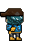
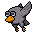
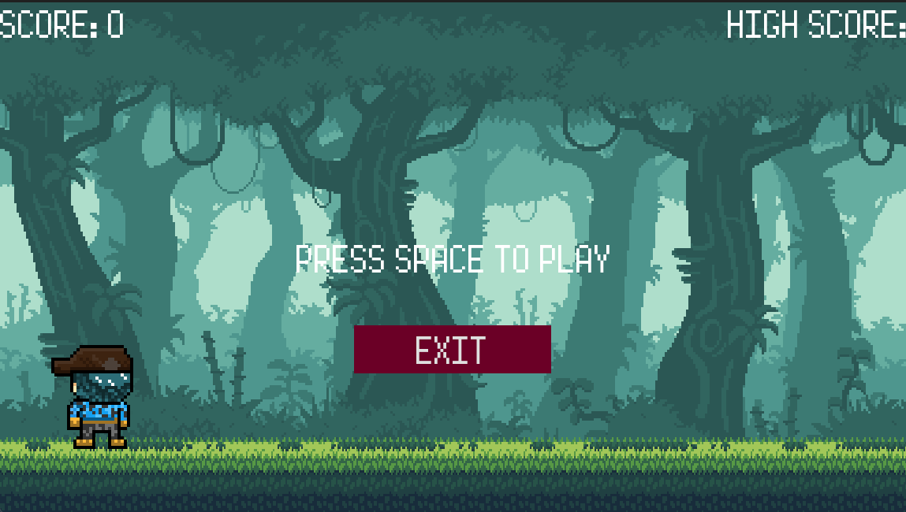

# The Adventure

  
  
  

Juego runner creado con Godot 4, juego que consiste en esquivar obstáculos mientras nuestro personaje corre por la selva, a medida avanzas iras sumando puntaje, visualmente solo funciona para windows. Gran parte de los assets son de la comunidad de GameDevs.

  

Los siguientes personajes son creados por mi, tanto su diseño y distintas animaciones.

  
  

    <a style="color: white; font-size: 30px; font-weight: bold; text-decoration: none; border: 2px solid white; border-radius: 5px; padding: 10px 50px; background-color: #0f4a40; display: flex; gap: 20px; align-items: center; justify-content:center; width: 200px;" href="./TheAdventure.exe">
      Descargar
      
    </a>
    

