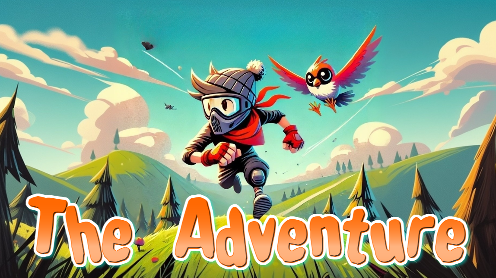
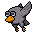
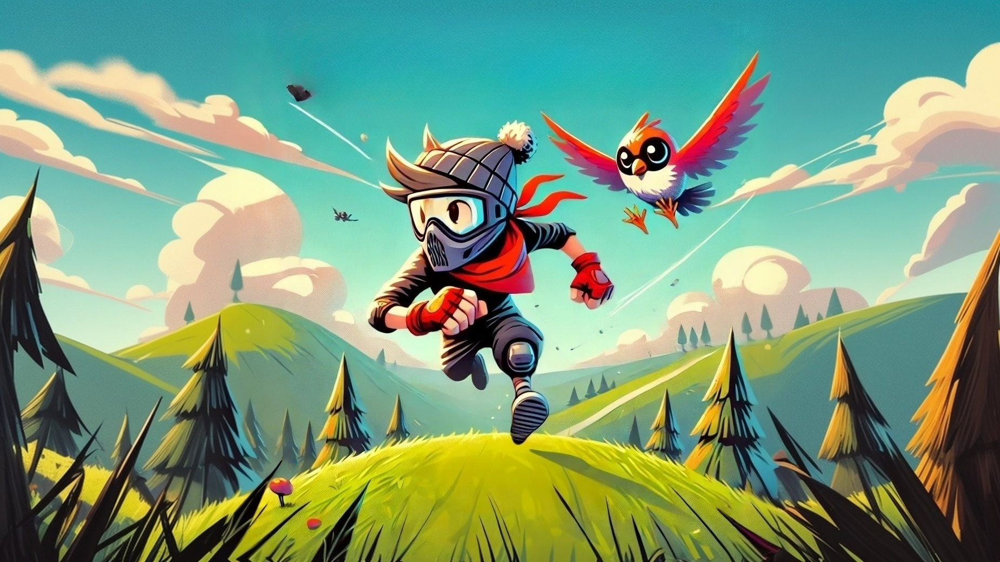
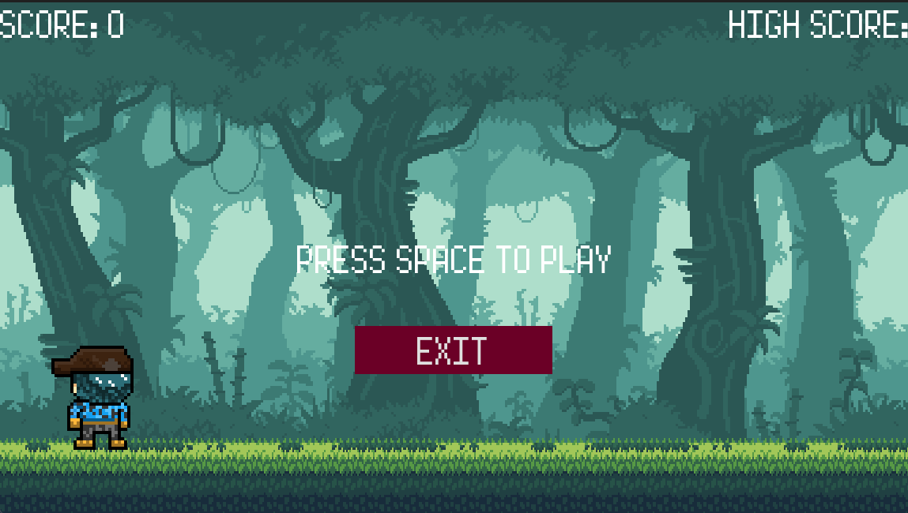

# The Adventure

  
  
  

Juego runner creado con Godot 4, juego que consiste en esquivar obstáculos mientras nuestro personaje corre por la selva, a medida avanzas iras sumando puntaje, visualmente solo funciona para windows. Gran parte de los assets son de la comunidad de GameDevs.

# Versiones
## v1.0.1

En relación a la version inicial, a esta version se le incorporo

- GUI (graphical user interface) logrando asi ser mas amigable y llamativo para los usuarios.
- Nueva animación de cruchdown para esquivar obstáculos.
- Corrección en colisiones.
- Compatibilidad con dispositivos android, aun que esta mantiene un bug por resoluciones dinámicas, las que iremos trabajando.
- Fondos corregidos en android, ahora toman la totalidad de la pantalla.
- Señales táctiles para jump o cruchdown.
- Nueva música.
- Escena para sponsors, de momento se muestra la nueva portada de The Adventure, el motor gráfico utilizado (GODOT 4) y la marca como desarrollador *Rawdev*.
- Nueva Portada.

## v1.0.0

  

Los siguientes personajes son creados por mi, tanto su diseño y distintas animaciones.

  
  

    <a style="color: white; font-size: 30px; font-weight: bold; text-decoration: none; border: 2px solid white; border-radius: 5px; padding: 10px 50px; background-color: #0f4a40; display: flex; gap: 20px; align-items: center; justify-content:center; width: 200px" href="./win/TheAdventure.exe">
      Windows
    </a> 
    <a style="color: white; font-size: 30px; font-weight: bold; text-decoration: none; border: 2px solid white; border-radius: 5px; padding: 10px 50px; background-color: #0f4a40; display: flex; gap: 20px; align-items: center; justify-content:center; width: 200px; margin: 20px;" href="./apk/TheAdventure.apk">
      Android (bugs)
    </a>
    

